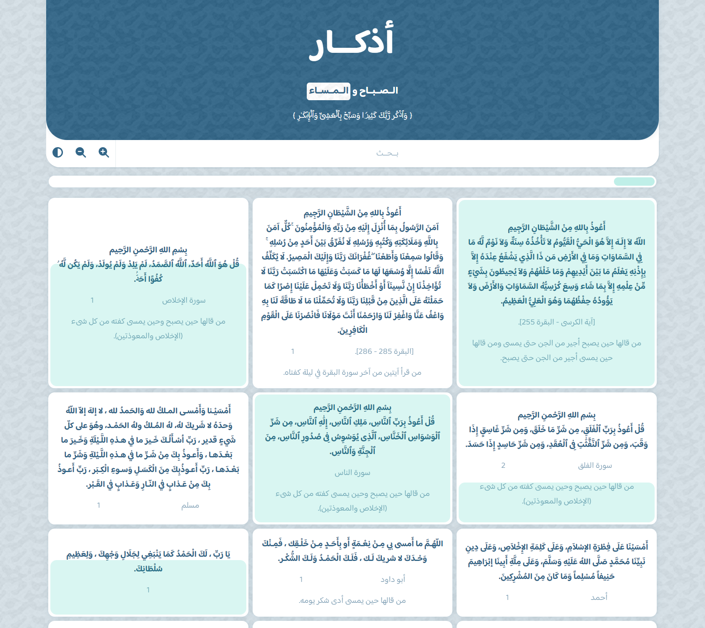
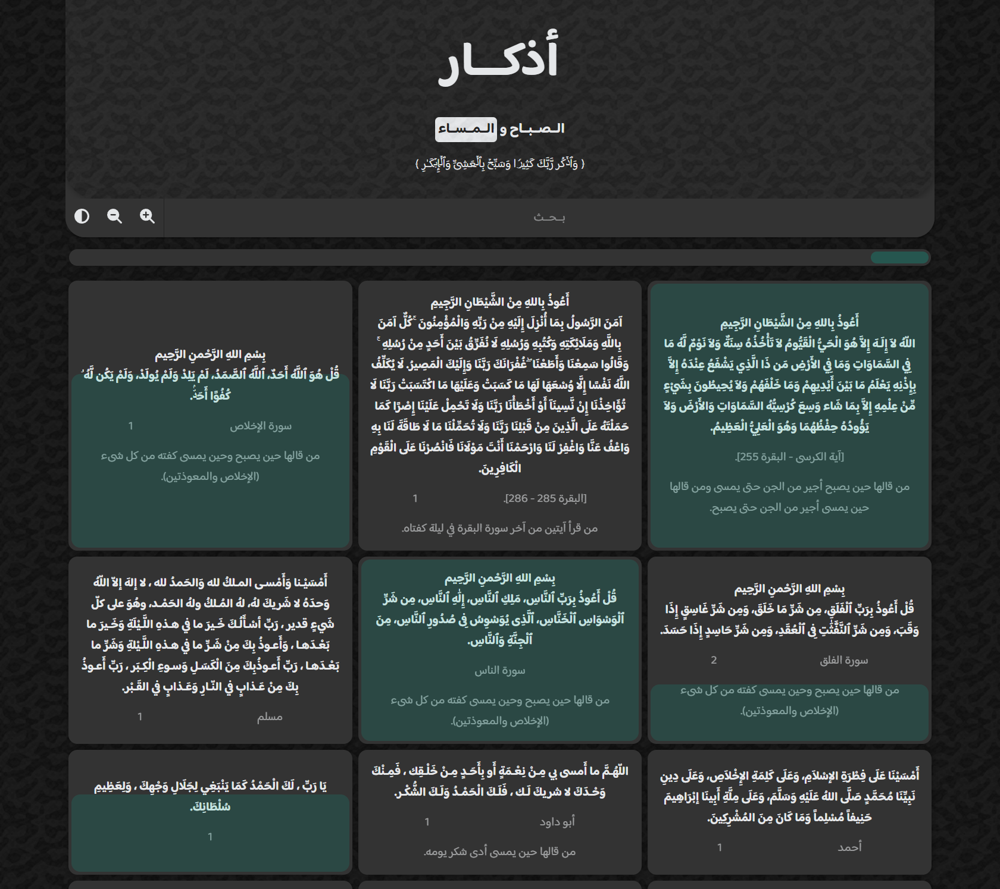

# Azkar

A Vue.js project that tracks muslims morning and evening Azkar (al-sabah w al-masaa).

It has some features that faciliting the use and encouraging the user on completing all the azkar and daily continuity.

## Features

- Search mechanism
  - can ignore the arabic tashkeel signs
- Dark theme
- Increase / Decrease font size
- Zekr progress tracker
- All azkar progress tracker

## Hosting

Become live on https://azkaar.netlify.app

## Preview

Light theme

Dark theme

Developped with &hearts; using Spck NodeJS android app.
